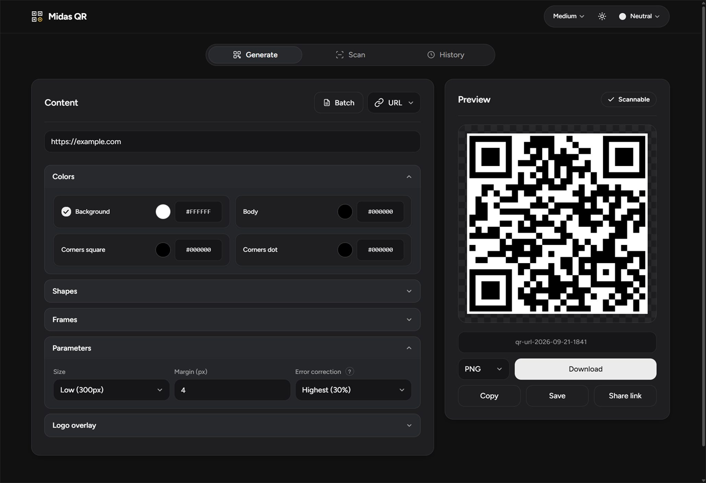
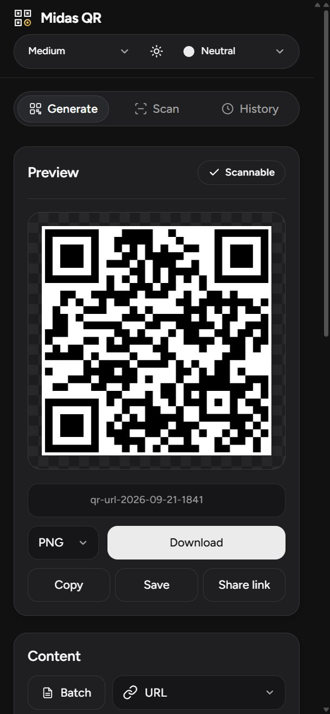

# Midas QR

A QR code generator and scanner that runs entirely in the browser. It works offline and sends nothing to a server.

### [Open the app](https://jimm144.github.io/midas-qr/)

| Desktop | Mobile |
| --- | --- |
|  |  |

## Features

**Content types** — URL, text, Wi-Fi, contact (vCard), crypto address, geolocation, calendar event, SMS, phone number, email.

**Styling** — dot shapes (square, rounded, extra rounded, classy, dots); corner styles for the finder squares and their centres; solid colors or linear/radial gradients; overall shapes (circle, heart, triangle, star, diamond, hexagon, shield, or a custom SVG path); frames (label, badge, dashed, rounded) with captions; background images; logo overlays.

**Output** — PNG, SVG, JPEG, WebP, and TXT (Unicode block art); copy to clipboard; batch generation from a CSV, TSV, or TXT file, one code per row.

**Scanning** — webcam or image upload, decoded in a Web Worker. Results can be opened, copied, or searched, and scanned codes are kept in a local history.

**App** — seven color themes (light, dark, or auto); Simple, Medium, and Full layout modes; share links that reopen the current configuration; keyboard shortcuts (`Ctrl/⌘+S` save, `Ctrl/⌘+C` copy, `R` re-render); installable PWA that works offline.

## Privacy

No accounts, no analytics, no third-party CDNs, no network requests. Text, Wi-Fi passwords, addresses, logos, and scans stay in the browser; history is stored in local storage.

## Install

Open the app in a browser and choose **Install** / **Add to Home Screen**. Camera scanning requires a secure (`https`) connection.

## Development

```bash
npm install
npm run build   # bundles JS and CSS, validates the offline layer
npm start       # serves the app on http://localhost:5000
```

| Command             | Description                                 |
| ------------------- | ------------------------------------------- |
| `npm start`         | Serve the built app on port 5000            |
| `npm run dev`       | Build, then serve                           |
| `npm run build`     | Bundle JS/CSS and validate the offline layer |
| `npm test`          | Run the test suite                          |
| `npm run lint`      | Lint the source                             |
| `npm run typecheck` | Type-check the typed modules                |

Run `npm run lint`, `npm run typecheck`, and `npm test` before opening a pull request.

## License

GPL-3.0 — see [LICENSE](./LICENSE). Bundled typefaces are SIL OFL 1.1; frame icons are Lucide (ISC). Full notices: [THIRD-PARTY-NOTICES.txt](./THIRD-PARTY-NOTICES.txt) and the in-app **Credits** dialog.
